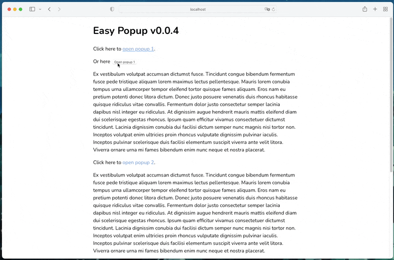

# Easy Popup

[](https://github.com/viivue/easy-popup/releases/latest)
[](https://www.jsdelivr.com/package/gh/viivue/easy-popup)
[](https://www.jsdelivr.com/package/gh/viivue/easy-popup)
[](https://app.netlify.com/sites/easy-popup/deploys)

> Super light-weight JavaScript library to create a simple popup with mobile layout.

## Getting started

### Download

Using CDN:

```html
<!-- Easy Popup -->
<link rel="stylesheet" href="https://cdn.jsdelivr.net/gh/viivue/easy-popup@0.2.2/dist/easy-popup.min.css">
<script src="https://cdn.jsdelivr.net/gh/viivue/easy-popup@0.2.2/dist/easy-popup.min.js"></script>
```


## Options

Init with HTML

```html
<!-- Using data attributes -->
<div data-easy-popup="demo"
     data-easy-popup-mobile="true"
     data-easy-popup-title="Popup title"
     data-easy-popup-theme="my-style"
     data-easy-popup-click-outside-to-close="false">
    <p>Your content.</p>
</div>
```

Init with JS

```js
EasyPopup.init('.popup', {
    id: 'popup-id', // required
    title: 'Demo 2', // title on mobile layout
    hasMobileLayout: false, // toggle mobile layout, false by default
    triggerSelector: '.open-demo-2', // set custom triggers
    closeButtonHTML: '<span>Click to close</span>', // set custom HTML for close button
    outerClass: 'my-popup', // custom class for popup
    theme: 'default', // to create multiple themes
    clickOutsideToClose: true, // true by default
    keyboard: true, // to close the popup by keyboard (ESC)
    autoShow: false, // boolean or number, e.g. 1000 for 1000ms after init

    // cookie
    cookie: undefined, // use PiaJs `expires`, see https://github.com/viivue/easy-popup#set-expires
    showingTimes: 1, // show n times before expiration day, only works with cookie
    // optional, change name will also lose access to the previous cookie => create a new cookie
    cookieName: '',

    preventScroll: true, // prevent page scroll when popup is open

    // events
    onOpen: data => {
    },
    onClose: data => {
    },
});
```

## Methods

```js
// get popup
const myPopup = EasyPopup.get('popup-id');

// control popup
myPopup.open();
myPopup.close();
myPopup.toggle();
myPopup.on("open", () => {
    // do something...
});
```

### Ignore click

Add class `easy-popup-ignore-click` to ignore click event. By default, all elements will have click event assigned by
Easy Popup. However, sometimes HTML that appends later via JS could lead to be treated as placed outside popup, which
leads to popup closing when that element clicked.

```html
<button class="easy-popup-ignore-click">My button</button>
```

## Themes

### theme:`right-side`



```html

<div data-easy-popup="demo" data-easy-popup-theme="right-side">
    <p>Your content.</p>
</div>
```

## Deployment

```shell
# Run dev server
npm run dev

# Build dev site
npm run build

# Generate production files, update version (package.json, _style.scss)
npm run prod
```

## License

[MIT License](https://github.com/viivue/easy-popup/blob/main/LICENSE)

Copyright (c) 2023 ViiVue
